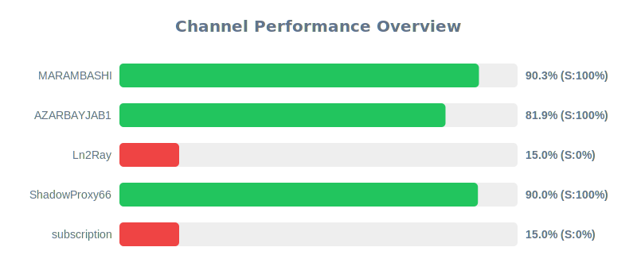

[](https://github.com/4n0nymou3/multi-proxy-config-fetcher/stargazers)
[](https://github.com/4n0nymou3/multi-proxy-config-fetcher/network/members)
[](https://github.com/4n0nymou3/multi-proxy-config-fetcher/issues)
[](https://github.com/4n0nymou3/multi-proxy-config-fetcher/blob/main/LICENSE)
[](https://github.com/4n0nymou3/multi-proxy-config-fetcher/commits)

# Multi Proxy Config Fetcher

[**🇺🇸English**](README.md) | [**فارسی**](README_FA.md) | [**🇨🇳中文**](README_CN.md) | [**🇷🇺Русский**](README_RU.md)

An advanced, automated proxy configuration management system that fetches, validates, tests, enriches, and filters proxy configurations from multiple sources.
This project provides enterprise-grade proxy management with real-time health monitoring, geographical tagging, and multi-stage security filtering.

## 🌐 Access Configurations

All proxy configurations and endpoints are available through our unified web interface:

### **[👉 Anonymous Proxy Hub - Access All Endpoints](https://4n0nymou3.github.io/Anonymous-Proxy-Hub/)**

The web interface provides:
- **7 Different Endpoints** for various use cases
- **Raw Configurations** - Unfiltered original configs
- **Xray Tested** - Configs verified with Xray core (Pass 1)
- **Xray Load Balanced** - Smart load-balanced JSON configs
- **Xray Secure** - High-security filtered configs
- **Sing-box All** - All configs in Sing-box format
- **Sing-box Tested** - Sing-box verified configs (Pass 2)
- **Sing-box Secure** - Maximum security Sing-box configs

## 📊 Source Performance Monitoring

Real-time performance statistics of all configured sources (Telegram channels and URLs).
This chart is automatically updated every 12 hours.

### Quick Overview
<div align="center">
  <a href="assets/channel_stats_chart.svg">
    
  </a>
</div>

### Detailed Analytics
📊 [View Full Interactive Dashboard](https://htmlpreview.github.io/?https://github.com/4n0nymou3/multi-proxy-config-fetcher/blob/main/assets/performance_report.html)

> **Important for Forked Repositories**:  
> If you fork this repository, replace `4n0nymou3` in the dashboard link above with your GitHub username to access your own analytics dashboard.

Each source is scored based on four key metrics:
- **Reliability Score (35%)**: Success rate in fetching and updating configurations
- **Config Quality (25%)**: Ratio of valid configs to total fetched
- **Config Uniqueness (25%)**: Percentage of unique configs contributed
- **Response Time (15%)**: Server response time and availability

Sources scoring below 30% are automatically disabled to maintain system quality.

## ✨ Key Features

### Multi-Protocol Support
- **WireGuard** - Modern, fast VPN protocol
- **Hysteria2** - High-performance proxy protocol
- **VLESS** - Lightweight VMess alternative
- **VMess** - Popular V2Ray protocol
- **Shadowsocks** - Secure SOCKS5 proxy
- **Trojan** - TLS-based proxy protocol
- **TUIC** - UDP-based proxy protocol

### Advanced Processing Pipeline

1. **Intelligent Fetching**
   - Supports Telegram channels, SSCONF links, and custom URLs
   - Automatic base64 decoding and format detection
   - Duplicate removal and validation

2. **Two-Stage Testing System**
   - **Pass 1**: Health check using Xray core
   - **Pass 2**: Health check using Sing-box core
   - Parallel testing with configurable workers
   - Custom timeout and test URL configuration

3. **Geographical Enrichment**
   - Automatic server location detection
   - Country flag emoji tagging
   - Support for multiple geolocation APIs
   - Intelligent fallback system

4. **Smart Renaming**
   - Descriptive tags with protocol details
   - Transport type identification (WS, GRPC, HTTP2, etc.)
   - Security feature detection (TLS, Reality, XTLS, Vision)
   - Port and country information

5. **Security Filtering**
   - Removes insecure encryption methods
   - Validates TLS/SSL configurations
   - Filters deprecated protocols
   - Generates separate secure endpoint files

6. **Format Conversion**
   - Automatic conversion to Sing-box JSON format
   - Xray load-balanced configuration generation
   - Maintains compatibility with both cores

## 🚀 Quick Start

### For Users (Recommended)

1. Visit the **[Anonymous Proxy Hub](https://4n0nymou3.github.io/Anonymous-Proxy-Hub/)**
2. Choose your preferred endpoint
3. Copy the URL and use it in your proxy client

### For Developers

#### Fork and Customize

1. Fork this repository
2. Edit `src/user_settings.py` to configure:
   - Source URLs (Telegram channels, SSCONF links, etc.)
   - Enabled protocols
   - Testing parameters
   - Geolocation API preferences
3. Enable GitHub Actions in your forked repository
4. Configurations will auto-update every 12 hours

#### Local Setup

```bash
# Clone the repository
git clone [https://github.com/4n0nymou3/multi-proxy-config-fetcher.git](https://github.com/4n0nymou3/multi-proxy-config-fetcher.git)
cd multi-proxy-config-fetcher

# Install dependencies
pip install -r requirements.txt

# Run the complete pipeline
python src/fetch_configs.py
python src/enrich_configs.py configs/proxy_configs.txt configs/location_cache.json
python src/rename_configs.py configs/location_cache.json configs/proxy_configs.txt configs/proxy_configs.txt
python src/xray_config_tester.py configs/proxy_configs.txt configs/proxy_configs_tested.txt
python src/config_to_singbox.py
python src/config_tester.py configs/singbox_configs_all.json configs/singbox_configs_tested.json
python src/security_filter.py
python src/xray_balancer.py

⚙️ Configuration Options
src/user_settings.py
# Source URLs
SOURCE_URLS = [
    "[https://t.me/s/your_channel](https://t.me/s/your_channel)",
    "[https://raw.githubusercontent.com/user/repo/main/configs.txt](https://raw.githubusercontent.com/user/repo/main/configs.txt)",
    # Add your sources here
]

# Power Mode
USE_MAXIMUM_POWER = True  # Fetch maximum configs
SPECIFIC_CONFIG_COUNT = 50  # Used if USE_MAXIMUM_POWER is False

# Protocol Filtering
ENABLED_PROTOCOLS = {
    "wireguard://": False,
    "hysteria2://": True,
    "vless://": True,
    "vmess://": True,
    "ss://": True,
    "trojan://": True,
    "tuic://": False,
}

# Config Age Filtering
MAX_CONFIG_AGE_DAYS = 1

# Sing-box Testing
ENABLE_SINGBOX_TESTER = True
SINGBOX_TESTER_MAX_WORKERS = 8
SINGBOX_TESTER_TIMEOUT_SECONDS = 10
SINGBOX_TESTER_URLS = ['[https://www.youtube.com/generate_204](https://www.youtube.com/generate_204)']

# Xray Testing
ENABLE_XRAY_TESTER = True
XRAY_TESTER_MAX_WORKERS = 8
XRAY_TESTER_TIMEOUT_SECONDS = 10
XRAY_TESTER_URLS = ['[https://www.youtube.com/generate_204](https://www.youtube.com/generate_204)']

# Geolocation APIs (in priority order)
LOCATION_APIS = [
    'api.iplocation.net',
    'freeipapi.com',
    'ip-api.com',
    'ipapi.co'
]

📁 Output Files
The system generates multiple output files for different use cases:
 * configs/proxy_configs.txt - Raw fetched configurations
 * configs/proxy_configs_tested.txt - Xray-tested configurations
 * configs/singbox_configs_all.json - All configs in Sing-box format
 * configs/singbox_configs_tested.json - Sing-box tested configs
 * configs/singbox_configs_secure.json - Security-filtered Sing-box configs
 * configs/xray_loadbalanced_config.json - Load-balanced Xray config
 * configs/xray_secure_loadbalanced_config.json - Secure load-balanced Xray config
 * configs/location_cache.json - Cached geolocation data
 * configs/channel_stats.json - Source performance metrics
🔄 Automation
The project uses GitHub Actions for automatic updates:
 * Runs twice daily (08:00 and 20:00 UTC)
 * Can be triggered manually via workflow_dispatch
 * Automatically commits and pushes updated configurations
 * Generates performance reports and charts
GitHub Actions Workflow
The workflow performs these steps in order:
 * Fetch configs from all sources
 * Enrich with geolocation data
 * Rename with descriptive tags
 * Test with Xray core (Pass 1)
 * Convert to Sing-box format
 * Test with Sing-box core (Pass 2)
 * Filter for security
 * Generate load-balanced configs
 * Update charts and reports
 * Commit and push changes
🛡️ Security Features
Automatic Security Filtering
The system automatically removes:
 * Insecure Shadowsocks ciphers (non-AEAD methods)
 * VMess with MD5 authentication (deprecated alter_id)
 * Unencrypted protocols (VLESS/Trojan without TLS)
 * Invalid TLS configurations (insecure=true)
 * VMess with security=none
Secure Endpoints
Dedicated secure endpoint files contain only configurations that meet modern security standards:
 * Valid TLS/SSL certificates
 * Modern encryption algorithms
 * No deprecated authentication methods
 * Proper certificate validation
📈 Performance Optimization
 * Parallel processing for faster config testing
 * Intelligent caching for geolocation data
 * Connection pooling for HTTP requests
 * Configurable timeouts to balance speed and reliability
 * Smart retry logic with exponential backoff
 * Resource cleanup to prevent memory leaks
🌍 Geolocation System
Multi-API Support
The system supports multiple free geolocation APIs with automatic fallback:
 * api.iplocation.net - Unlimited, fast, accurate
 * freeipapi.com - 60 req/min, very fast
 * ip-api.com - 45 req/min, reliable
 * ipapi.co - 1000 req/day
Smart Detection
 * Automatic URL pattern detection
 * Efficient caching to minimize API calls
 * Graceful degradation if APIs fail
 * No API keys required
📊 Statistics and Monitoring
Real-time Metrics
The system tracks comprehensive metrics for each source:
 * Total configs fetched
 * Valid vs invalid ratio
 * Unique config contribution
 * Average response time
 * Success/failure rates
 * Overall health score
Visual Dashboards
 * SVG Chart - Quick performance overview
 * Interactive HTML Report - Detailed analytics with:
   * Active/inactive sources
   * Protocol distribution
   * Response time analysis
   * Historical trends
🤝 Contributing
Contributions are welcome! Here's how you can help:
 * Report Issues - Found a bug? Open an issue
 * Suggest Features - Have an idea? Start a discussion
 * Submit PRs - Improvements are always appreciated
 * Add Sources - Know good proxy sources? Share them
 * Improve Docs - Help make documentation better
⚠️ Disclaimer
This project is provided for educational and informational purposes only. The developers are not responsible for:
 * Any misuse of this software
 * Any damage or losses incurred
 * The quality or security of third-party proxy configurations
 * Violations of local laws or regulations
Users are responsible for:
 * Ensuring compliance with local laws
 * Verifying the security of configurations
 * Understanding the risks of using proxy services
 * Respecting the terms of service of proxy providers
📜 License
This project is licensed under the MIT License - see the LICENSE file for details.
👤 About the Developer
Developed with ❤️ by 4n0nymou3
 * 🐙 GitHub: @4n0nymou3
 * 🐦 Twitter/X: @4n0nymou3
 * 📦 Repository: multi-proxy-config-fetcher
🙏 Acknowledgments
 * Xray-core - High-performance proxy platform
 * Sing-box - Universal proxy platform
 * GitHub Actions - Automation infrastructure
<div align="center">
⬆ Back to Top
Made with 💚 by Anonymous
</div>